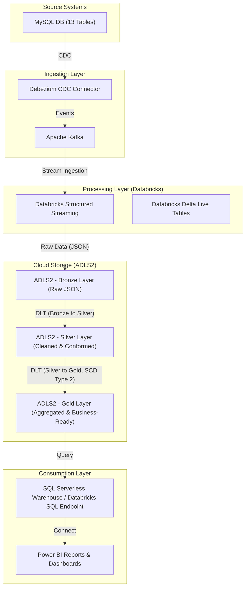

# Realtime-ETL-Pipeline: Real-time Banking Data ETL with Medallion Architecture

Realtime-ETL-Pipeline is a comprehensive, real-time Extract, Transform, Load (ETL) pipeline designed for enterprise banking data analytics and live dashboarding. It leverages Change Data Capture (CDC) to ingest data from a MySQL transactional database, processes it through a Medallion Architecture on Databricks, and delivers actionable insights to Power BI for business intelligence.

## Project Overview

This project establishes a robust and scalable data pipeline for banking operations, enabling real-time analysis of critical data such as customer profiles, account activities, and ATM transactions. The architecture is built to handle high-volume streaming data, ensure stringent data quality, and support comprehensive historical analysis through Slowly Changing Dimensions (SCD) Type 2.

## Architecture Diagram



## Key Components and Data Flow

### 1. Source System: MySQL Database

-   **Description**: The operational database for banking transactions, containing 13 core tables such as `customers`, `accounts`, `atm_transactions`, `loans`, `cards`, `branches`, `employees`, `transaction_types`, `audit_logs`, `products`, `services`, `transaction_details`, and `merchants`.
-   **Data Format**: Relational data, serving as the single source of truth for banking operations.

### 2. Ingestion Layer: Debezium & Kafka

-   **Debezium CDC Connector**: Configured to monitor the `banking_db` database on a MySQL instance (`dbserver1`). It captures all row-level changes (inserts, updates, deletes) from the 13 specified tables and converts them into standardized JSON event messages.
-   **Apache Kafka**: A high-throughput, fault-tolerant distributed streaming platform. Debezium publishes the captured CDC events to dedicated Kafka topics (e.g., `dbserver1.banking_db.customers`, `dbserver1.banking_db.accounts`), ensuring reliable and scalable real-time data transfer.
-   **Data Format**: JSON messages, each encapsulating a database change event with `before` and `after` states, operation type (`op`), and metadata.

### 3. Cloud Storage: Azure Data Lake Storage Gen2 (ADLS2) - Medallion Architecture

ADLS2 serves as the primary, scalable, and cost-effective storage layer, implementing a Medallion Architecture with distinct zones for progressive data refinement.

-   **Bronze Layer (Raw Data Lake)**:
    -   **Purpose**: Stores raw, immutable CDC event data directly ingested from Kafka. This layer acts as a historical archive of all changes.
    -   **Data Format**: Delta Lake tables, storing the raw JSON payload as a string, partitioned by source table.
    -   **Processing**: Databricks Structured Streaming continuously ingests data from Kafka topics and writes it to corresponding Delta tables in this layer (e.g., `abfss://bronze@youradls2account.dfs.core.windows.net/banking_cdc/customers/`).

-   **Silver Layer (Cleaned & Conformed Data Lake)**:
    -   **Purpose**: Stores cleaned, filtered, and conformed data. Raw JSON payloads are parsed, validated, and transformed into structured Delta tables.
    -   **Data Format**: Delta Lake format, providing ACID transactions, schema enforcement, and time travel capabilities.
    -   **Processing**: Databricks Delta Live Tables (DLT) are used to transform data from Bronze to Silver. This involves:
        -   Parsing raw JSON CDC events into structured columns based on predefined schemas (`banking_schema.py`).
        -   Filtering out malformed records or irrelevant CDC operations.
        -   Applying basic data type conversions and initial data quality checks.
        -   Flattening nested JSON structures into tabular format.

-   **Gold Layer (Aggregated & Business-Ready Data Lake)**:
    -   **Purpose**: Stores highly refined, aggregated, and denormalized data optimized for specific business intelligence and analytical use cases.
    -   **Data Format**: Delta Lake format, designed for high-performance querying.
    -   **Processing**: Databricks DLT applies further transformations from Silver to Gold. This layer incorporates:
        -   **Slowly Changing Dimensions (SCD) Type 2**: Implemented for tracking historical changes in key dimension tables (e.g., `gold_customer_dimension`). This ensures that reports can accurately reflect data as it was at any point in time, maintaining a full history of changes.
        -   Aggregations (e.g., daily transaction summaries, monthly account balances).
        -   Joining multiple Silver layer tables to create comprehensive fact and dimension tables (e.g., `gold_daily_account_balances`, `gold_daily_transactions_summary`).

### 4. Processing Layer: Databricks

-   **Databricks Structured Streaming**: Utilized for continuous, incremental data ingestion from Kafka to the Bronze layer, ensuring low-latency data availability.
-   **Databricks Delta Live Tables (DLT)**: A declarative framework for building reliable, maintainable, and testable data pipelines. DLT automates pipeline orchestration, error handling, data quality enforcement (with expectations), and monitoring, making it ideal for managing complex Bronze-to-Silver and Silver-to-Gold transformations, including sophisticated SCD Type 2 logic.

### 5. Consumption Layer: SQL Serverless & Power BI

-   **SQL Serverless Warehouse / Databricks SQL Endpoint**: Provides a high-performance, scalable SQL interface to query the Gold layer Delta tables. This allows business users and reporting tools to access data using standard SQL without managing underlying compute resources, ensuring optimal query performance.
-   **Power BI Reports & Dashboards**: Connects directly to the SQL Serverless Warehouse to fetch data from the Gold layer. It visualizes the processed banking data, providing live, interactive dashboards and reports for business users, enabling real-time operational insights and strategic decision-making.

## Features

-   **Real-time Data Ingestion**: Captures and processes data changes from MySQL in near real-time using Debezium and Kafka.
-   **Scalable & Robust Architecture**: Built on industry-leading technologies (Kafka, Databricks, ADLS2, Delta Lake) to handle massive data volumes and ensure high availability.
-   **Enterprise Data Quality & Governance**: Medallion Architecture enforces data quality standards and provides a structured, auditable approach to data transformation.
-   **Comprehensive Historical Analysis**: SCD Type 2 implementation ensures accurate historical reporting of dimension changes, crucial for compliance and trend analysis.
-   **Automated & Resilient Pipelines**: Databricks DLT automates pipeline deployment, monitoring, error recovery, and data quality checks.
-   **Seamless Business Intelligence**: Direct integration with Power BI for intuitive, interactive, and live dashboards.

## Setup and Deployment

*(Detailed setup instructions for each component, including MySQL configuration for Debezium, Kafka cluster setup, ADLS2 provisioning, Databricks workspace configuration, and Power BI report development, will be provided in dedicated deployment guides.)*

## Project Structure

```
Realtime-ETL-Pipeline/
├── README.md                           # Project overview and architecture documentation
├── requirements.txt                    # Python dependencies for Databricks notebooks
├── banking_schema.py                   # Defines realistic Pyspark schemas for all 13 banking tables
├── dlt_pipelines/                      # Databricks Delta Live Tables definitions
│   ├── bronze_to_silver.py             # DLT pipeline for Bronze to Silver transformations (parsing, cleaning)
│   └── silver_to_gold.py               # DLT pipeline for Silver to Gold transformations (aggregations, SCD Type 2)
├── structured_streaming/               # Databricks Structured Streaming notebooks
│   └── kafka_to_bronze.py              # Structured Streaming job for Kafka to Bronze ingestion
├── config/                             # Configuration files for external services
│   ├── debezium_connector_config.json  # Debezium MySQL CDC connector configuration
│   └── kafka_topics.json               # Kafka topic definitions with partitions and replication factors
├── sql_scripts/                        # SQL scripts for Gold layer views/tables (for SQL Serverless/Databricks SQL)
│   └── gold_layer_views.sql            # Example SQL views for Power BI consumption
└── powerbi_templates/                  # Power BI report templates
    └── finstream_dashboard.pbix        # Placeholder for Power BI report template
```

## Technologies

-   **MySQL**
-   **Debezium**
-   **Apache Kafka**
-   **Azure Data Lake Storage Gen2 (ADLS2)**
-   **Databricks (Structured Streaming, Delta Live Tables, SQL Analytics)**
-   **Delta Lake**
-   **Power BI**
-   **Python / PySpark**

## License

This project is open source and available under the MIT License.
