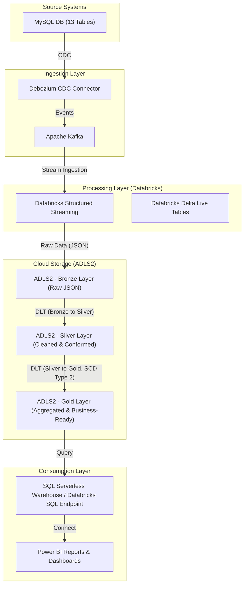

# FinStream-CDC: Real-time Banking Data ETL with Medallion Architecture

FinStream-CDC is a comprehensive, real-time Extract, Transform, Load (ETL) pipeline designed for banking data analytics and live dashboarding. It leverages Change Data Capture (CDC) to ingest data from a MySQL transactional database, processes it through a Medallion Architecture on Databricks, and delivers insights to Power BI for business intelligence.

## Project Overview

This project establishes a robust and scalable data pipeline for banking operations, enabling real-time analysis of critical data such as customer information, accounts, and ATM transactions. The architecture is built to handle high-volume streaming data, ensure data quality, and support historical analysis through Slowly Changing Dimensions (SCD) Type 2.

## Architecture Diagram



## Key Components and Data Flow

### 1. Source System: MySQL Database

-   **Description**: The origin of all banking transactional and master data. It consists of 13 different tables, including `customer`, `account`, `atm_transaction`, `loan`, `card`, etc.
-   **Data Format**: Relational data.

### 2. Ingestion Layer: Debezium & Kafka

-   **Debezium CDC Connector**: A distributed platform that turns your existing databases into event streams. It monitors the MySQL database for row-level changes (inserts, updates, deletes) and captures these changes as events.
-   **Apache Kafka**: A distributed streaming platform that acts as a high-throughput, fault-tolerant message broker. Debezium publishes the captured CDC events to Kafka topics, ensuring reliable and scalable data transfer.
-   **Data Format**: JSON messages (each message representing a database change event).

### 3. Cloud Storage: Azure Data Lake Storage Gen2 (ADLS2) - Medallion Architecture

ADLS2 serves as the primary storage layer, implementing a Medallion Architecture with distinct zones for data quality and transformation.

-   **Bronze Layer (Raw Data Lake)**:
    -   **Purpose**: Stores raw, immutable data directly ingested from Kafka.
    -   **Data Format**: JSON, preserving the original schema and structure of the CDC events.
    -   **Processing**: Databricks Structured Streaming continuously ingests data from Kafka and writes it to this layer.

-   **Silver Layer (Cleaned & Conformed Data Lake)**:
    -   **Purpose**: Stores cleaned, filtered, and conformed data. Data is parsed, validated, and enriched.
    -   **Data Format**: Delta Lake format, enabling ACID transactions, schema enforcement, and time travel capabilities.
    -   **Processing**: Databricks Delta Live Tables (DLT) are used to transform data from Bronze to Silver. This involves:
        -   Parsing JSON payloads.
        -   Filtering out unwanted records.
        -   Applying basic data type conversions and cleaning.
        -   Flattening nested structures.

-   **Gold Layer (Aggregated & Business-Ready Data Lake)**:
    -   **Purpose**: Stores aggregated, denormalized, and business-ready data optimized for reporting and analytics.
    -   **Data Format**: Delta Lake format.
    -   **Processing**: Databricks DLT applies further transformations from Silver to Gold. This layer incorporates:
        -   **Slowly Changing Dimensions (SCD) Type 2**: Implemented for tracking historical changes in dimension tables (e.g., `customer` details). This ensures that reports can accurately reflect data as it was at any point in time.
        -   Aggregations (e.g., daily transaction summaries, customer lifetime value).
        -   Joining multiple Silver tables to create comprehensive fact and dimension tables.

### 4. Processing Layer: Databricks

-   **Databricks Structured Streaming**: Used for continuous, incremental data processing from Kafka to the Bronze layer of ADLS2.
-   **Databricks Delta Live Tables (DLT)**: A declarative framework for building reliable, maintainable, and testable data pipelines. DLT automates pipeline orchestration, error handling, and monitoring, making it ideal for managing the Bronze-to-Silver and Silver-to-Gold transformations, including SCD Type 2 logic.

### 5. Consumption Layer: SQL Serverless & Power BI

-   **SQL Serverless Warehouse / Databricks SQL Endpoint**: Provides a high-performance, scalable SQL interface to query the Gold layer Delta tables. This allows business users and reporting tools to access data without managing underlying compute resources.
-   **Power BI Reports & Dashboards**: Connects to the SQL Serverless Warehouse to fetch data from the Gold layer. It visualizes the processed banking data, providing live dashboards and interactive reports for business users, enabling informed decision-making.

## Features

-   **Real-time Data Ingestion**: Captures and processes data changes from MySQL in near real-time.
-   **Scalable Architecture**: Built on Kafka, Databricks, and ADLS2 to handle growing data volumes.
-   **Data Quality & Governance**: Medallion Architecture ensures data quality and provides a structured approach to data transformation.
-   **Historical Analysis**: SCD Type 2 implementation allows for accurate historical reporting of dimension changes.
-   **Automated Pipelines**: Databricks DLT automates pipeline deployment, monitoring, and recovery.
-   **Business Intelligence**: Seamless integration with Power BI for interactive dashboards and reporting.

## Setup and Deployment

*(Detailed setup instructions for each component will be provided in subsequent files or documentation.)*

## Project Structure

```
FinStream-CDC/
├── README.md                           # Project overview and architecture documentation
├── requirements.txt                    # Python dependencies for Databricks notebooks
├── dlt_pipelines/                      # Databricks Delta Live Tables definitions
│   ├── bronze_to_silver.py             # DLT pipeline for Bronze to Silver transformations
│   └── silver_to_gold.py               # DLT pipeline for Silver to Gold transformations (incl. SCD Type 2)
├── structured_streaming/               # Databricks Structured Streaming notebooks
│   └── kafka_to_bronze.py              # Structured Streaming job for Kafka to Bronze ingestion
├── config/                             # Configuration files
│   ├── debezium_connector_config.json  # Debezium MySQL connector configuration
│   └── kafka_topics.json               # Kafka topic definitions
├── sql_scripts/                        # SQL scripts for Gold layer views/tables
│   └── gold_layer_views.sql            # SQL views for Power BI consumption
└── powerbi_templates/                  # Power BI report templates (optional)
    └── finstream_dashboard.pbix        # Power BI report template
```

## Technologies

-   **MySQL**
-   **Debezium**
-   **Apache Kafka**
-   **Azure Data Lake Storage Gen2 (ADLS2)**
-   **Databricks (Structured Streaming, Delta Live Tables)**
-   **Delta Lake**
-   **Power BI**
-   **Python / PySpark**

## License

This project is open source and available under the MIT License.
